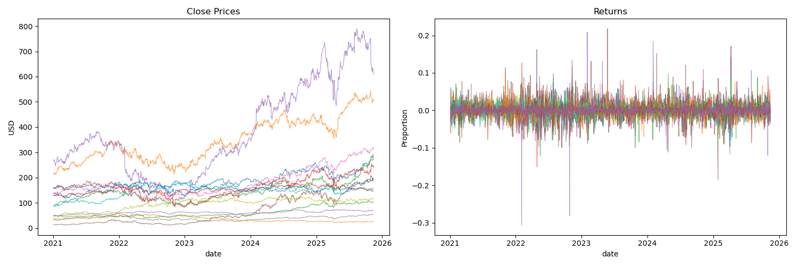
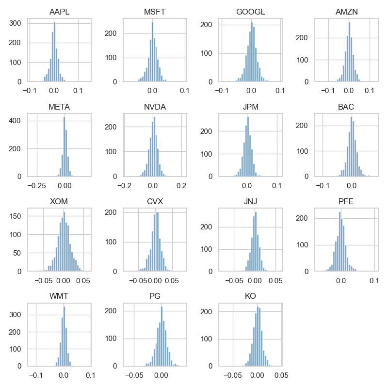
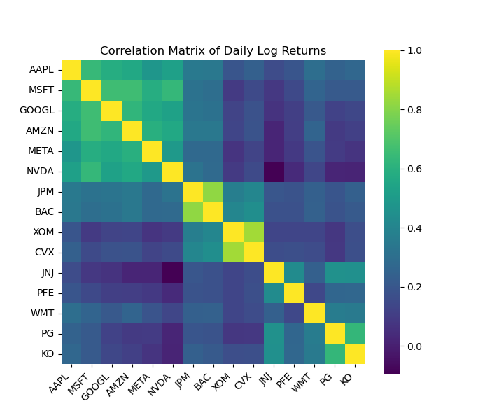
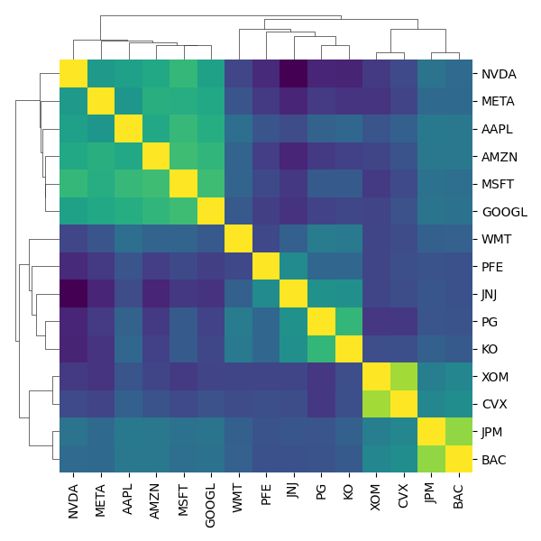

# Part A — Data Download, Processing & Initial Exploration

For this section, we collect and preprocess **daily stock return data** from **January 2021 to present** for the following 15 large-cap U.S. companies:

```
AAPL, MSFT, GOOGL, AMZN, META, NVDA,
JPM, BAC, XOM, CVX, JNJ, PFE, WMT, PG, KO
```
Daily closing prices are downloaded and aligned on trading days. 



We compute **daily log-returns** using:  $r_t = \log\left(\frac{P_t}{P_{t-1}}\right)$ to achieve a more Gaussian-like distribution, which is important for graphical model assumptions. 



The distributions across returns appear Gaussian (which is expected of course).

---

### Correlation Structure of Daily Log-Returns

| Correlation Matrix | Hierarchical Clustering |
|----------------------------------|-----------------------------------------|
|  |  |


The heatmap on the left shows the **pairwise correlation matrix** of daily log-returns across all 15 stocks from January 2021 to present. Strong positive correlations appear along the diagonal blocks, especially within sectors such as:

- **Tech:** AAPL, MSFT, GOOGL, AMZN, META, NVDA  
- **Financial:** JPM, BAC  
- **Energy:** XOM, CVX  
- **Consumer Staples:** PG, KO, WMT  

These clusters indicate that stocks within the same sector tend to move together, reflecting shared market drivers and common risk exposures.

The plot on the right applies **hierarchical clustering** to the same correlation matrix. This reorders the assets based on similarity, revealing more clearly which stocks form tightly related groups. The resulting dendrogram structure shows natural clusters, helping motivate the use of **graphical models** to learn conditional dependencies beyond simple correlations.

---

Together, these plots provide an initial understanding of return structure, dependencies, and distributional behavior before fitting graphical models.


