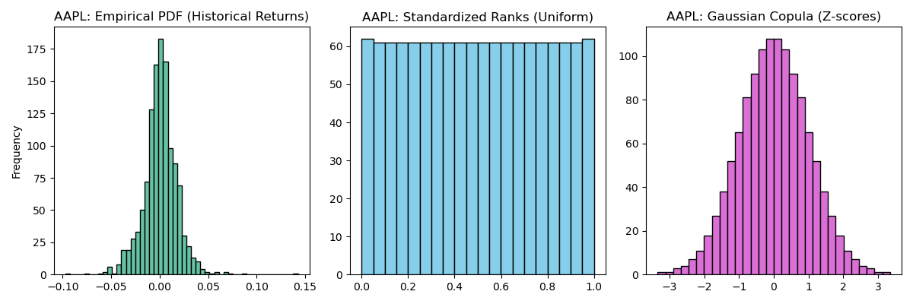
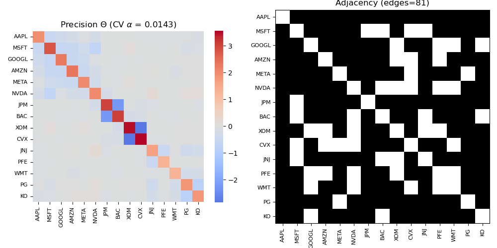

# Graphical Lasso

### Initial Graphical Lasso Fit Across an $\alpha$-Grid

Before selecting any hyperparameter, we begin by fitting Graphical Lasso across a grid of penalty values $\alpha \in \{0.001, 0.01, 0.1, 0.5\}$ to visualize how regularization shapes the structure of the estimated precision matrix.

Smaller $\alpha$ values produce **dense graphs** with many conditional dependencies, while larger $\alpha$ values encourage **sparser**, more interpretable structure.  
Inspecting this grid helps us see:

- which edges disappear first as regularization increases,  
- which relationships remain persistent across a wide range of $\alpha$,  
- how the overall graph topology transitions from dense (low $\alpha$) to sparse (high $\alpha$).

This exploratory step provides intuition before applying cross-validation or stability selection.

### Cross-Validated Graphical Lasso

We begin by estimating the penalty parameter $\alpha^*$ using **Graphical Lasso with cross-validation**.  
Cross-validation maximizes the Gaussian log-likelihood on held-out data, which is **problematic for graph structure learning** because the Gaussian log-likelihood **always increases** as the model becomes denser. Therefore CV **prefers graphs with many edges** and tends to **under-penalize** (i.e., choose $\alpha$ that is too small), resulting in adjacency matrices that are **overly dense** and difficult to interpret.

This is illustrated in the CV fit below:

Even though CV does not promote sparsity, the selected $\alpha^\*$ still provides a useful **starting graph**, which we later refine using *stability selection*. With this CV-chosen $\alpha^*$, the corresponding precision matrix captures **direct conditional dependencies** between variables after controlling for all others.

### Bootstrap Stability Selection

Again, CV is known to **favor overly dense graphs** in Gaussian graphical models. To address this limitation, we complement the CV-chosen model with **stability selection**, which identifies only the *most persistent* structure in the data. The idea is to retain edges that appear consistently under random perturbations of the dataset, and treat unstable edges as noise.

Concretely, we perform **10,000 bootstrap resamples**, refit the Graphical Lasso on each resampled dataset, and record whether each edge is present. Aggregating these results yields a **selection frequency matrix**, where entry $(i,j)$ is the proportion of bootstrap fits in which the edge $\overline{ij}$ appears.

Interpretation:

- The heatmap visualizes how often each edge is selected across all 10,000 runs.  
- Thresholding at levels `0.75, 0.90, 0.95, 0.99, 1.0` (plus `1.01` to show the cutoff) reveals progressively stricter definitions of *stability*.  
- Edges with frequency **1.0** are present in *every* bootstrap fit—representing the **most robust, data-supported conditional dependencies**.

Unlike marginal correlation, these stable edges correspond to **direct partial dependencies** that persist even after conditioning on all other variables. Stability selection therefore isolates the most reliable structural relationships in the graphical model.

---

# Nonparanormal Graphical Model

### Copula-Based Marginal Gaussianization

Before fitting the nonparanormal graphical model, we first apply the **Gaussian copula (rank $\rightarrow$ uniform $\rightarrow$ Gaussian)** transform to each variable. This transformation preserves **all monotone dependence relationships**, removes marginal skewness and heavy tails, and produces a dataset whose **marginals are Gaussian**, but whose **dependence structure** is unchanged.

To illustrate this transformation, the plots below show (across a single ticker):

1. [LEFT] **Empirical returns** — approximately Gaussian but with noticeable deviations (e.g., mild skewness or t-distribution-like heavy tails)
2. [MIDDLE] **Standardized ranks** — approximately $\text{Uniform}(0,1)$  
3. [RIGHT] **Inverse-normal scores** — approximately $\mathcal{N}(0,1)$  

This verifies that the copula transform succeeds in Gaussianizing the marginals.

---

### Applying Graphical Lasso to Copula-Transformed Data

After transforming the raw returns matrix $X$ into its Gaussianized version $Z$, we repeat the same pipeline used for the Gaussian graphical model:

1. Fit **Graphical Lasso with cross-validation** to obtain $\alpha^*$.  
2. Extract the estimated precision matrix and adjacency structure.  
3. Perform **10,000-bootstrap stability selection** to identify robust edges.

The cross-validated result for the nonparanormal model is shown below:

As before, cross-validation tends to prefer denser graphs, so this serves as a **starting point** rather than a final model.

---

### Bootstrap Stability Selection (Nonparanormal)

We again perform stability selection under the nonparanormal transformation. For each bootstrap sample:

- resample rows of the copula-transformed matrix $Z$,
- refit Graphical Lasso using the fixed $\alpha^*$ from CV,
- record whether each edge appears.

Accumulating over 10,000 bootstrap fits yields a **selection-frequency heatmap** and thresholded adjacency matrices:

These plots show how frequently each edge persists under sampling variability. Edges with frequency **1.0** appear in *every* bootstrap fit and represent the **most stable** conditional dependencies in the nonparanormal model.

---

### Summary

- The copula transform allows us to fit a **semiparametric** graphical model that relaxes Gaussian marginal assumptions.  
- After Gaussianizing the marginals, the standard Graphical Lasso machinery applies unchanged.  
- In our dataset, the Gaussian and nonparanormal models produce **nearly identical graphs**, confirming that the raw returns are already close to Gaussian.  
- Stability selection again highlights a small set of **robust partial dependencies** that persist across both models.

This completes the nonparanormal graphical model analysis.
