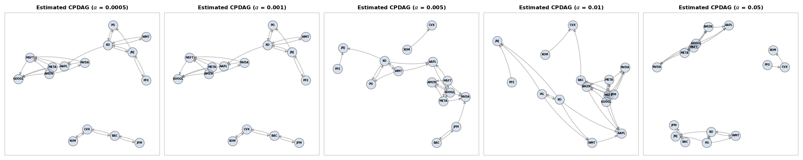
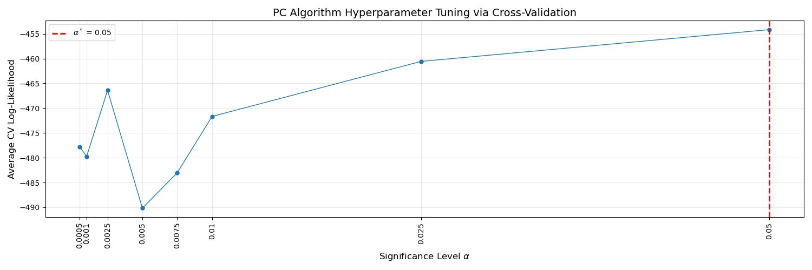
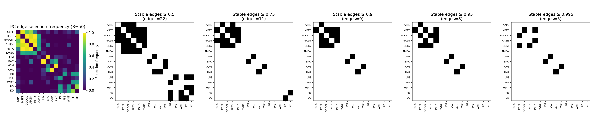

# Applied PC Algorithm

### Selecting the PC Algorithm Significance Level ($\alpha^*$)

Before performing any quantitative tuning, I first visualized the directed CPDAG output of the PC algorithm across a grid of significance levels $\alpha \in \{0.001, 0.005, 0.01, 0.05\}$ to understand how graph sparsity evolves as the conditional-independence threshold changes. This exploratory step helps reveal how sensitive the directed structure is to $\alpha$ and provides intuition about which values preserve meaningful sector-level dependencies and which values oversimplify the graph.  

To tune the Type I error rate in the PC algorithm, I used **K-fold cross-validation** based on the Gaussian log-likelihood implied by the conditional-independence tests. For a grid of values $\alpha \in \{0.001, 0.005, 0.01, 0.05\}$, the PC algorithm was fit on each training split to estimate a graph structure. Given this structure, I fit a Gaussian graphical model on the same training fold (using Graphical Lasso) and evaluated the held-out Gaussian log-likelihood on the validation fold. This provides an unsupervised, likelihood-based criterion for comparing different significance levels. The average validation scores across folds are shown below.

Cross-validation selects $\alpha^* = 0.05$, which achieves the highest held-out likelihood and therefore provides the best generalization performance under the Gaussian model. This value is used for the final PC estimate and for the subsequent stability analysis.

### Stability Analysis

Using the cross-validated value $\alpha^* = 0.05$, I performed $B = 50$ bootstrap resamples to assess the robustness of the learned PC graph. For each bootstrap sample, I refit the PC algorithm, extracted the undirected skeleton of the resulting CPDAG, and recorded whether each edge appeared. This yields a selection frequency $\hat{\pi}_{ij} = \frac{\text{number of bootstraps where edge } i\text{--}j \text{ appears}}{B}$ which measures the stability of each edge under resampling.

The left panel shows the selection-frequency heatmap. The subsequent panels threshold these frequencies at increasing stability cutoffs. Edges that consistently survive at high thresholds correspond to stable conditional-dependence relationships. In this dataset, strong sector-level structures remain highly stable—particularly the mega-cap technology group, the JPM–BAC banking link, the XOM–CVX energy pair, and the consumer-staples/healthcare connections—while weaker cross-sector edges disappear as the threshold increases. This confirms that the major clusters identified by the PC algorithm reflect reproducible features of the data.
