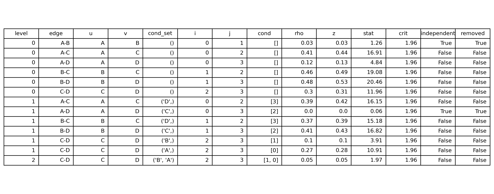
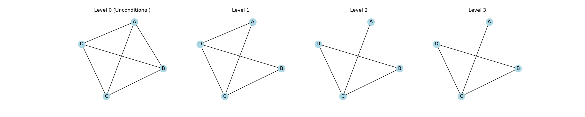
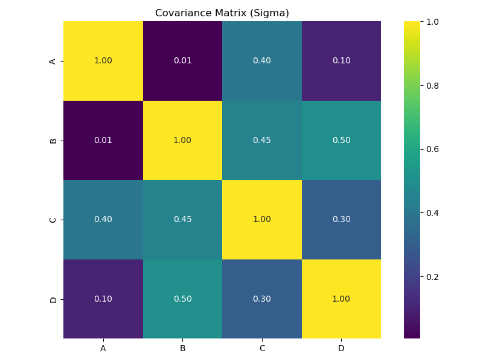
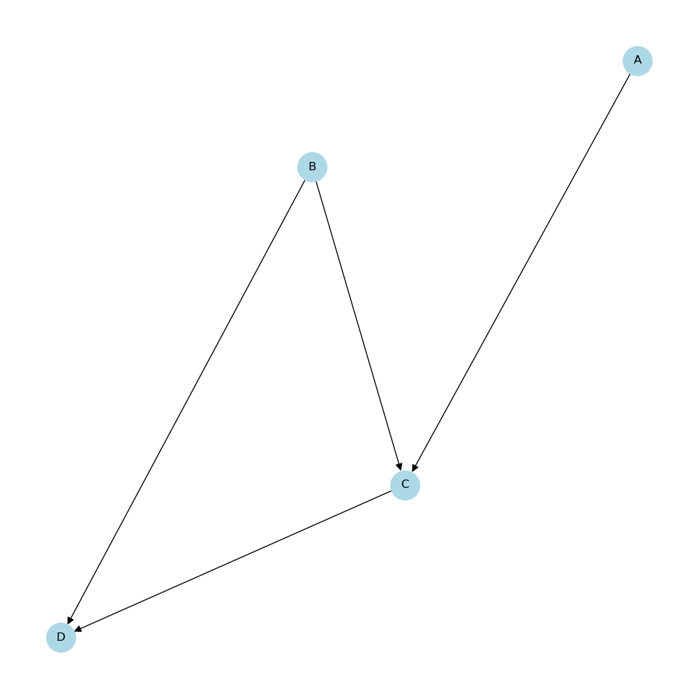

# PC Algorithm Demo

### Undirected Skeleton

**Iteration 1** proceeds with edge $\overline{AB}$ and tests it with 
conditioning set $S=\emptyset$, i.e. $A \perp B \mid \emptyset$. 
We test the hypotheses 
$$H_0:\rho=0 \quad \text{vs} \quad H_1:\rho\neq0.$$
The Fisher–Z test returns $\text{stat}=1.26,$ which is below the cutoff $\text{crit}=\Phi^{-1}(1-\alpha/2)=1.96.$ Thus we **fail to reject** $H_0$ (fail to reject independence). Since the 
PC algorithm removes edges judged to be independent, we **remove** 
the edge $\overline{AB}$.

This iterative algorithm continues conditioning on $|S| \in \{0,1,2\}$ as shown in the table below. 

The iterative algorithm continues by testing conditional independencies for 
conditioning sets of size $|S| \in \{0,1,2\}$, as shown in the table above. 
The first phase of the PC algorithm terminates once an iteration produces 
**no additional edge removals**. At that point, further increasing the size 
of the conditioning sets cannot reveal new independencies, and the skeleton 
has stabilized. 

Thus, we have now established the **undirected graphical skeleton** of the underlying causal structure.

The heatmap above displays the population covariance matrix used to generate the data. Since the data is sampled from a multivariate Gaussian distribution, near-zero covariance corresponds to (conditional) independence. In particular, the pairs $\overline{AB}$ and $\overline{AD}$ exhibit very weak covariance, indicating that these variables are approximately independent. Consistent with this population structure, the PC algorithm removes both edges during the skeleton-learning phase.

### Orientation Phase: From Skeleton to CPDAG

Once the undirected graphical skeleton has been recovered, the PC algorithm proceeds to **orient as many edges as possible** using conditional-independence information. This produces a **Completed Partially Directed Acyclic Graph** (CPDAG), which represents the entire Markov equivalence class of DAGs consistent with the observed independencies.

The orientation stage proceeds in two steps.

---

## **Step 1: Identify V-Structures (Unshielded Colliders)**

A triple of nodes $(X, Y, Z)$ forms a *v-structure* if:

1. $X$ and $Z$ are both adjacent to $Y$ in the skeleton,  
2. $X$ and $Z$ are **not** adjacent to each other, and  
3. $X \not\!\perp Z \mid Y$ (i.e., $Y$ does *not* block the path).

When these conditions hold, PC orients the triple as: $X \rightarrow Y \leftarrow Z.$

In our recovered skeleton, the triple $(A, C, B)$ satisfies these conditions:

- $\overline{ABC}$ exists in the skeleton,  
- $A$ and $B$ are **not** adjacent (edge removed at Level 0),  
- and the CI table shows $A \not\!\perp B \mid C$.

Thus PC orients: $A \rightarrow C \leftarrow B,$ establishing a **collider at $C$**.

---

## **Step 2: Apply Meek’s Orientation Propagation Rules**

After orienting all v-structures, the remaining edges are oriented using 
Meek’s deterministic rules, which ensure that:

- no new v-structures are created inadvertently, and  
- no directed cycles are formed.

The two rules relevant for this graph are:

**Rule 1 (Avoid creating new colliders):**  
If $X \rightarrow \overline{YZ}$ and $X$ and $Z$ are not adjacent, orient $\overline{YZ} \;\Rightarrow\; Y \rightarrow Z.$

**Rule 2 (Avoid directed cycles):**  
If there is a directed path $X \rightarrow \cdots \rightarrow Y$ and an 
undirected edge $\overline{XY}$, orient $\overline{XY} \;\Rightarrow\; X \rightarrow Y.$

---

## **Applying Meek’s Rules to Our Skeleton**

After orienting the v-structure $A \rightarrow C \leftarrow B$, the remaining 
undirected edges in the skeleton are $\overline{CD}$ and $\overline{BD}$.

1. Since $A \rightarrow C$ and $A$ is not adjacent to $D$, Rule 1 orients $C \rightarrow D.$

2. With $B \rightarrow C \rightarrow D$ now forming a directed path, Rule 2 
   requires that the edge $\overline{BD}$ be oriented as $B \rightarrow D.$

No further orientations are permitted without violating acyclicity or creating 
spurious v-structures.

---

## **Final Result: The CPDAG**

The final oriented graph is therefore: $A \rightarrow C \leftarrow B, \qquad C \rightarrow D, \qquad B \rightarrow D.$

This is the **CPDAG** representing the Markov equivalence class of DAGs 
compatible with the conditional-independence relations in the data.

