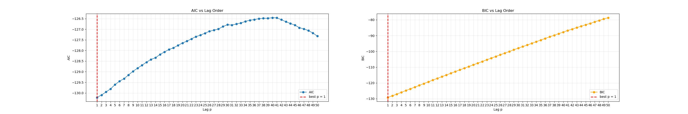
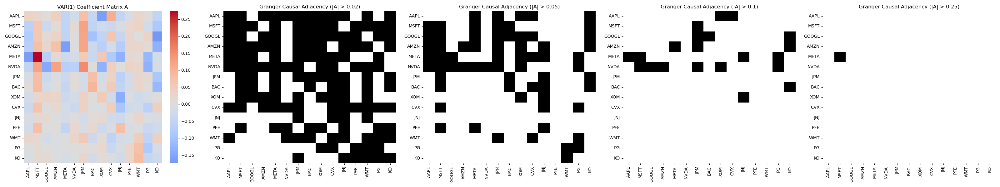
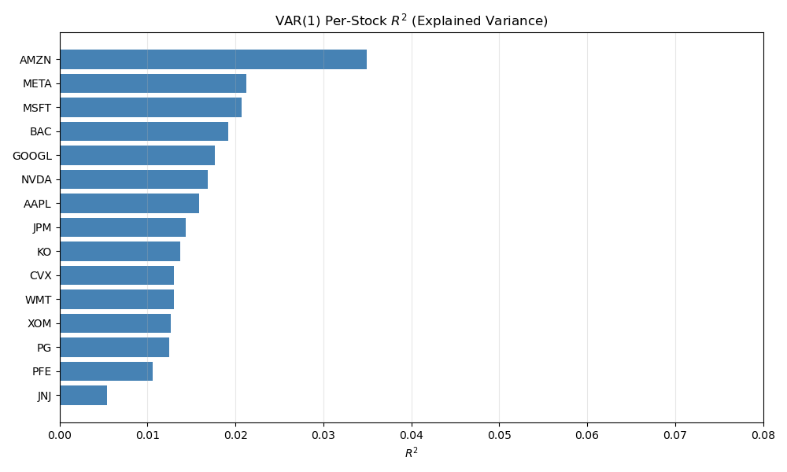

# VAR(p) Model

We fit a Vector Autoregressive model of order $p$ to the daily log-returns of the 15-stock universe. A VAR($p$) models the system as $X_t = A_1 X_{t-1} + \cdots + A_p X_{t-p} + \varepsilon_t$, where $A_\ell$ are coefficient matrices and $\varepsilon_t$ is an uncorrelated innovation term. The sole hyperparameter is the lag order $p$, which we selected by evaluating AIC and BIC over $p \in \{1,\dots,50\}$. This gridsearch is plotted below.

Both AIC and BIC were minimized at $p = 1$, so we fit a VAR(1). The estimated model is $X_t = A X_{t-1} + \varepsilon_t$, where $A$ is a $15 \times 15$ matrix capturing Granger-type predictive influences. Each entry $A_{jk}$ measures the contribution of stock $k$ yesterday to stock $j$ today.

We visualize the VAR(1) coefficient matrix via a heatmap and construct directed Granger adjacency graphs by thresholding $|A|$ at several levels. At moderate thresholds (e.g. $|A| > 0.05$), we observe clear sectoral structure: large technology names exhibit multiple cross-lag edges, while energy and financial stocks show smaller but interpretable predictive effects. At higher thresholds the graph becomes sparse, indicating that strong linear predictability across daily returns is limited.

To assess model fit, we compute per-stock $R^2 = 1 - \operatorname{Var}(\varepsilon_j) / \operatorname{Var}(X_j)$, which ranges from approximately $0.5\%$ to $3.5\%$. This is expected for daily equity returns, which are dominated by unpredictable idiosyncratic shocks. 

